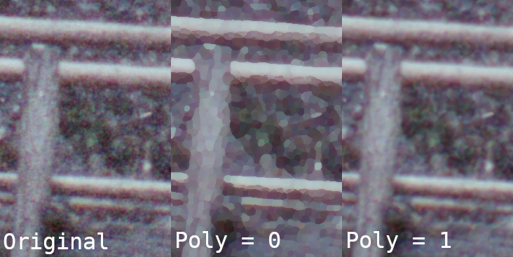

# pcell
cli, resembles the kuwahara-filter for png-images.

the commandline does have following parameters\
source.png	any png-file, that exists, is taken as source\
target.png	any png-files, that does not exists, is taken as target. The path to the target must exists, the program does not create directories.
- `-r`	integer - step1: radius of the circle, that is calculated for standard deviation
- `-s`	integer - step2: radius for looking for a circle from step1 with a low standard deviation
- `-p`	integer - formula for calculating the standard deviation, can have following values:
	- `0`	take a mean of all channels, is closest to the standard kuwahara
	- `1`	take a linear regression, fares much better with gradients of color
	- `2`	biquadratic regression, strong effect, but is considerably slower
	- `3`	bicubic regression, strongest effect, also the slowest, and still has artefacts on the edges of the image
-  `-b`	integer - make multiple images with increased search-radius, the values start with the value provided by parameter `s`and end with `s+b`. The filename __must__ contain a percent sign, which will be replaced by a two digit value for the actual search-radius.

